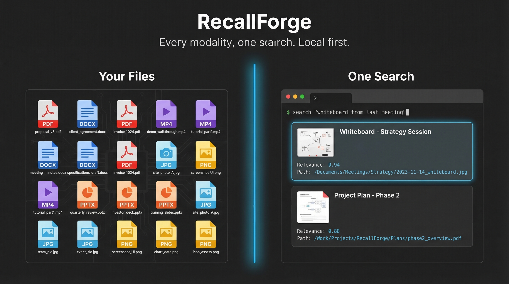
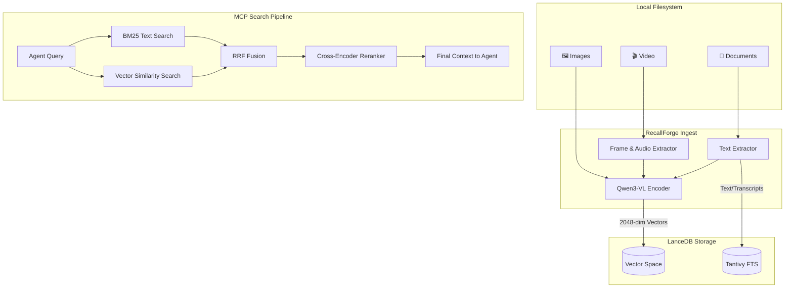

# RecallForge

   

**Every modality, one search. Local first.**



Standard RAG only works on text. Drop a PDF with charts, a photo of a whiteboard, or a video recording — and your AI agent goes blind. RecallForge gives agents **eyes and ears over your local filesystem**. Text, images, documents, and video all live in one unified search space, and nothing ever leaves your machine.

## What this enables

> **You:** "What did the whiteboard look like in our last meeting?"
>
> **Claude:** *(Searches your local `~/Documents`, finds a photo of a whiteboard from an iPhone, reads the handwriting via Qwen3-VL, and surfaces the image with context.)*

> **You:** "Find the architecture diagram from that PDF I downloaded last week."
>
> **Claude:** *(Indexes the PDF, matches your query against extracted text and embedded figures, returns the relevant page.)*

> **You:** *(Drops an image of a circuit board)* "Find my notes related to this."
>
> **Claude:** *(Reverse image-to-text search across your indexed notes. Returns matching documents.)*

One query. Any modality. All local.

## What makes RecallForge different

| Capability | RecallForge | Chroma | Mem0 | Qdrant | Weaviate |
|------------|-------------|--------|------|--------|----------|
| Cross-modal search | ✅ Native | ✅ OpenCLIP | ❌ Text only | ❌ | ✅ CLIP modules |
| Video support [Beta] | ✅ | ❌ | ❌ | ❌ | ❌ |
| Document ingest (PDF/DOCX/PPTX) | ✅ | ❌ | ❌ | ❌ | ❌ |
| Built-in reranking | ✅ Multimodal | ❌ | ❌ | ✅ ColBERT | ✅ Modules |
| Query expansion | ✅ Multimodal | ❌ | ❌ | ❌ | ✅ Generative |
| MCP-native | ✅ 17 tools | ❌ | ❌ | ❌ | ❌ |
| 100% local | ✅ | ✅ | ⚠️ Cloud default | ✅ | ✅ Docker |
| Apple Silicon optimized | ✅ MLX 4-bit | ❌ | ❌ | ❌ | ❌ |
| Cloud option | ❌ | ✅ | ✅ | ✅ | ✅ |
| JS/TS SDK | ❌ | ✅ | ✅ | ✅ | ✅ |

**Use RecallForge when:** You need multimodal memory for AI agents that runs entirely on your machine, especially on Apple Silicon. One search across text, images, documents, and video.

**Use something else when:** You need cloud hosting, massive scale (millions+ vectors), or a JS/TS-first ecosystem.

## Performance

4 modalities (text, images, documents, video) unified in a single MLX-optimized local vector space. Sub-60ms search latency. Under 400MB resident memory.

Measured on Mac mini M4 16GB, MLX 4-bit, embed mode:

| Metric | MLX 4-bit | PyTorch fp16 |
|--------|-----------|--------------|
| Warm search p50 | 53ms | 599ms |
| Warm search p95 | 55ms | — |
| Cold start | 7.6s | ~20s |
| Peak RSS (embed) | 329MB* | ~4GB |
| Text indexing | 5.0 docs/sec | — |

*\*MLX maps model weights lazily via memory-mapped files. RSS reflects resident pages, not full model size (~1.7GB on disk for embed mode). Actual memory pressure is low.*

Search quality comes from the multi-stage pipeline (BM25 + vector + RRF fusion + cross-encoder reranking), not raw embedding accuracy alone.

## Installation

```bash
pip install recallforge[mlx]       # Apple Silicon (recommended, 4-bit quantization)
pip install recallforge[cuda]      # NVIDIA GPU
pip install recallforge[torch]     # CPU / other PyTorch targets
pip install recallforge[docs]      # add richer PDF extraction (optional)
```

> **Note:** `pip install recallforge` installs the core without a backend.
> You need at least one of `[mlx]`, `[cuda]`, or `[torch]` to run inference.

From source:

```bash
git clone https://github.com/brianmeyer/recallforge.git
cd recallforge
pip install -e ".[mlx]"
```

### Requirements

- Python 3.12 or 3.13 required (3.14 not yet supported, pending pyarrow wheel)
- Disk: ~2-5GB free for model downloads on first run
- RAM (MLX 4-bit): ~1.7GB (`embed`) to ~4.4GB (`full`)
- `ffmpeg` recommended for video indexing/search
- First run downloads models automatically and may take a few minutes

## MCP Server (primary use)

RecallForge is designed as a **Model Context Protocol server for AI agents**. Configure in Claude Desktop (or any MCP-compatible agent host):

```json
{
  "mcpServers": {
    "recallforge": {
      "command": "recallforge",
      "args": ["serve", "--mode", "full"]
    }
  }
}
```

Run manually:

```bash
recallforge serve --mode embed --backend mlx --quantize 4bit
```

Exposes **17 tools** for agents: `ingest`, `search`, `search_fts`, `search_vec`, `index_document`, `index_image`, `memory_add`, `memory_update`, `memory_delete`, `index_folder`, `status`, `rebuild_fts`, `list_collections`, `list_namespaces`, `batch`, `get_config`, `set_config`.

See [docs/mcp-tools.md](docs/mcp-tools.md) for the full tool reference.

## Search modes

| Mode | Models loaded | Memory (MLX 4-bit) | Quality | Best for |
|------|--------------|-------------------|---------|----------|
| `embed` | Embedder | ~1.7GB | Good | Memory-constrained, fast searches |
| `hybrid` | + Reranker | ~3.4GB | Better | Balanced quality and memory |
| `full` | + Query Expander | ~4.4GB | Best | Maximum retrieval quality |

> **Video [Beta] note:** Video support requires `ffmpeg`. The torch backend video path has a known upstream issue (see [QwenLM/Qwen3.5#58](https://github.com/QwenLM/Qwen3.5/issues/58)).

## How it works

RecallForge encodes text, images, and video frames into the same 2048-dimensional vector space using Qwen3-VL. This means "find notes about this diagram" works whether the diagram is text, an image, or a frame from a video. A 3-stage pipeline handles the rest:



**Pipeline:** BM25 probe → Query expansion (full mode) → Parallel BM25 + Vector → RRF fusion → Reranking (hybrid/full) → Score blending

## CLI (development & debugging)

```bash
# Index anything
recallforge index ./photos ./docs
recallforge index ~/Movies/demo.mp4
recallforge index ~/Documents/roadmap.pptx

# Search any modality
recallforge search "whiteboard diagram from last meeting"
recallforge search --image ./photos/whiteboard.png
recallforge search --video ~/Movies/demo.mp4

# Watch a folder for changes (auto-index)
recallforge watch start ~/Documents --collection docs
recallforge watch list
recallforge watch stop ~/Documents

# Status
recallforge status
```

RecallForge auto-detects MLX on Apple Silicon, PyTorch elsewhere.

## Python API

```python
from recallforge import get_backend, get_storage
from recallforge.search import HybridSearcher

backend = get_backend()
storage = get_storage()
backend.warm_up()

# Index
storage.index_document(
    path="notes.md",
    text="My notes about AI...",
    collection="my_docs",
    model="Qwen3-VL-Embedding-2B",
    embed_func=backend.embed_text,
)

# Search
searcher = HybridSearcher(backend=backend, storage=storage, limit=10)
results = searcher.search("artificial intelligence")
for r in results:
    print(f"[{r.score:.3f}] {r.title}")
```

## Configuration

| Variable | Default | Description |
|----------|---------|-------------|
| `RECALLFORGE_BACKEND` | `auto` | `auto`, `mlx`, `torch` |
| `RECALLFORGE_MODE` | `full` | `embed`, `hybrid`, `full` |
| `RECALLFORGE_MLX_QUANTIZE` | `4bit` | `4bit`, `bf16` |
| `RECALLFORGE_STORE_PATH` | `~/.recallforge` | Storage directory |

## Project structure

```
src/recallforge/
├── backends/
│   ├── mlx_backend.py    # MLX 4-bit/bf16 (Apple Silicon)
│   └── torch_backend.py  # PyTorch (CUDA/MPS/CPU)
├── storage/
│   └── lancedb_backend.py # LanceDB + Tantivy FTS
├── cache.py              # LRU embedding cache
├── search.py             # Hybrid search pipeline (BM25 + vector + RRF)
├── server.py             # MCP server (17 tools)
├── documents.py          # PDF/DOCX/PPTX extraction
├── video.py              # Frame/transcript extraction
├── watch_folder.py       # Folder monitoring with dedup
└── cli.py                # CLI interface
```

## Development

```bash
pytest tests/ -m "not live"    # Unit tests (no model download needed)
pytest tests/ -m live -v       # Integration tests (requires models)
```

See [CONTRIBUTING.md](CONTRIBUTING.md) for full development guidelines.

## Attribution

RecallForge is inspired by [QMD](https://github.com/tobil/qmd) by Tobi. QMD pioneered the multi-stage retrieval pipeline (embedding, reranking, query expansion). RecallForge extends this pattern to vision-language with cross-modal retrieval and multi-backend support.

## License

MIT License
