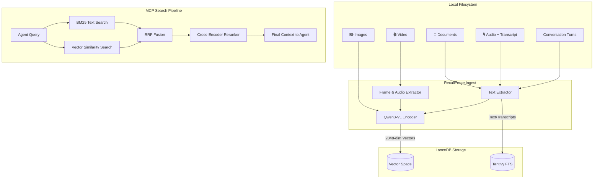

# RecallForge

 [](https://pypi.org/project/recallforge/)  

**Every modality, one search. Local first.**


Standard RAG only works on text. Drop a PDF with charts, a photo of a whiteboard, a video recording, or a transcript-backed audio note — and your AI agent goes blind. RecallForge gives agents **eyes and ears over your local filesystem**. Text, images, documents, video, and audio transcripts all live in one unified search space, and nothing ever leaves your machine.

## What this enables

> **You:** "What did the whiteboard look like in our last meeting?"
>
> **Claude:** *(Searches your local `~/Documents`, finds a photo of a whiteboard from an iPhone, reads the handwriting via Qwen3-VL, and surfaces the image with context.)*

> **You:** "Find the architecture diagram from that PDF I downloaded last week."
>
> **Claude:** *(Indexes the PDF, matches your query against extracted text and embedded figures, returns the relevant page.)*

> **You:** *(Drops an image of a circuit board)* "Find my notes related to this."
>
> **Claude:** *(Reverse image-to-text search across your indexed notes. Returns matching documents.)*

One query. Any modality. All local.

## What makes RecallForge different

| Capability | RecallForge | Chroma | Mem0 | Qdrant | Weaviate |
|------------|-------------|--------|------|--------|----------|
| Cross-modal search | ✅ Native | ✅ OpenCLIP | ❌ Text only | ❌ | ✅ CLIP modules |
| Video support [Beta] | ✅ | ❌ | ❌ | ❌ | ❌ |
| Audio transcript ingest | ✅ | ❌ | ❌ | ❌ | ❌ |
| Document ingest (PDF/DOCX/PPTX) | ✅ | ❌ | ❌ | ❌ | ❌ |
| Built-in reranking | ✅ Multimodal | ❌ | ❌ | ✅ ColBERT | ✅ Modules |
| MCP-native | ✅ 26 tools | ❌ | ❌ | ❌ | ❌ |
| 100% local | ✅ | ✅ | ⚠️ Cloud default | ✅ | ✅ Docker |
| Apple Silicon optimized | ✅ MLX 4-bit | ❌ | ❌ | ❌ | ❌ |
| Cloud option | ❌ | ✅ | ✅ | ✅ | ✅ |
| JS/TS SDK | ❌ | ✅ | ✅ | ✅ | ✅ |

**Use RecallForge when:** You need multimodal memory for AI agents that runs entirely on your machine, especially on Apple Silicon. One search across text, images, documents, video, and transcript-backed audio.

**Use something else when:** You need cloud hosting, massive scale (millions+ vectors), or a JS/TS-first ecosystem.

## Performance

5 modalities (text, images, documents, video, transcript-backed audio) unified in a single MLX-optimized local vector space. Sub-60ms search latency in embed mode. Under 400MB resident memory.

### Pipeline ablation (Mac mini M4 16GB, MLX 4-bit)

Each stage of the pipeline improves retrieval quality. The reranker is the quality peak.

| Stage | R@1 | R@5 | R@10 | MRR | p50 |
|-------|-----|-----|------|-----|-----|
| Vector-only | 65.2% | 65.2% | 67.4% | 67.3% | 20ms |
| BM25-only | 57.6% | 57.6% | 93.5% | 64.4% | 17ms |
| Vector + BM25 (RRF) | 69.6% | 88.0% | 90.2% | 77.5% | 100ms |
| **+ Reranker (hybrid mode)** | **85.9%** | **92.4%** | **97.8%** | **89.2%** | 3.8s |

The reranker delivers **+20.7% R@1 over RRF fusion** and pushes R@10 to 97.8%. Embed mode gives you 20ms searches for speed-sensitive workloads. Hybrid mode gives you 85.9% R@1 when quality matters.

*Benchmark categories: text_only (30 queries), image_only (30 queries), long_query (12 queries), typo_query (20 queries). See `benchmarks/results/pipeline_ablation_modality_results.json` for full breakdown.*

For release validation, use `benchmarks/cross_modal_ablation.py`. It checkpoints JSON output as it runs, so long MLX benchmark sessions still leave behind a partial artifact if interrupted. The UAT video corpus now uses compact episodic fixtures with searchable transcript sidecars and related artifact metadata, so video queries exercise meeting, screen-recording, walkthrough, field, and recipe-style memories. To turn a benchmark artifact into a ranked fix list, run `benchmarks/cross_modal_diagnostics.py`; the current report is in [docs/research/cross-modal-diagnostics.md](docs/research/cross-modal-diagnostics.md).

### Latency & resource usage

| Metric | MLX 4-bit | PyTorch fp16 |
|--------|-----------|--------------|
| Warm search p50 (embed) | 53ms | 599ms |
| Warm search p95 (embed) | 55ms | — |
| Cold start | 7.6s | ~20s |
| Peak RSS (embed) | 329MB* | ~4GB |
| Peak RSS (hybrid) | ~1.5GB* | ~5GB |
| Text indexing | 5.0 docs/sec | — |

*\*MLX maps model weights lazily via memory-mapped files. RSS reflects resident pages, not full model size (~1.7GB embedder + ~1.7GB reranker on disk). Actual memory pressure is low.*

### COCO 1K retrieval (raw embeddings, no pipeline)

For transparency: raw embedding quality on the standard COCO benchmark (1,000 images, no BM25/reranking/expansion). These numbers reflect the Qwen3-VL-2B embedder alone, not the full pipeline.

| Direction | R@1 | R@5 | R@10 |
|-----------|-----|-----|------|
| Text → Image | 24.5% | 42.3% | 49.9% |
| Image → Text | 34.3% | 42.0% | 44.1% |

*Qwen3-VL is a generative VLM, not a contrastive model like CLIP. The pipeline ablation above shows how BM25 fusion and reranking compensate for this.*

## Installation

```bash
pip install recallforge[mlx]       # Apple Silicon (recommended, 4-bit quantization)
pip install "recallforge[mlx,server]"  # Apple Silicon + HTTP/SSE server
pip install recallforge[cuda]      # NVIDIA GPU
pip install recallforge[torch]     # CPU / other PyTorch targets
pip install recallforge[docs]      # add richer PDF extraction (optional)
```

> **Note:** `pip install recallforge` installs the core without a backend.
> You need at least one of `[mlx]`, `[cuda]`, or `[torch]` to run inference.
> Add `[server]` only when you want HTTP/SSE transport (`recallforge serve --http`).

From source:

```bash
git clone https://github.com/brianmeyer/recallforge.git
cd recallforge
pip install -e ".[mlx]"
```

### Requirements

- Python 3.12 or 3.13 required (3.14 not yet supported, pending pyarrow wheel)
- Disk: ~2-5GB free for model downloads on first run
- RAM (MLX 4-bit): ~1.7GB (`embed`) to ~3.4GB (`hybrid`)
- `ffmpeg` recommended for video indexing/search
- Audio indexing is transcript-first: add a `.srt`, `.vtt`, `.txt`, or `.transcript.json` sidecar next to the audio file
- First run downloads models automatically and may take a few minutes

## MCP Server (primary use)

RecallForge is designed as a **Model Context Protocol server for AI agents**. Configure in Claude Desktop (or any MCP-compatible agent host):

```json
{
  "mcpServers": {
    "recallforge": {
      "command": "recallforge",
      "args": ["serve", "--mode", "hybrid"]
    }
  }
}
```

Run manually (stdio):

```bash
recallforge serve --mode embed --backend mlx --quantize 4bit
```

Run over HTTP/SSE:

```bash
recallforge serve --http --host 127.0.0.1 --port 7433 --mode embed
```

RecallForge now exposes **26 MCP tools** across search, ingest, memory graph navigation, collection admin, and runtime config. HTTP/SSE mode also exposes `/health`, `/sse`, and `/messages/`.

See [docs/mcp-tools.md](docs/mcp-tools.md) for the full tool reference.

## Search modes

| Mode | Models loaded | Memory (MLX 4-bit) | Quality | Best for |
|------|--------------|-------------------|---------|----------|
| `embed` | Embedder | ~1.7GB | Good | Memory-constrained, fast searches |
| `hybrid` | Embedder + Reranker | ~3.4GB | Best | Maximum retrieval quality |

> **Video [Beta] note:** Video support requires `ffmpeg`. The torch backend video path has a known upstream issue (see [QwenLM/Qwen3.5#58](https://github.com/QwenLM/Qwen3.5/issues/58)).

## How it works

RecallForge encodes text, images, video frames, documents, conversation turns, and audio transcripts into the same 2048-dimensional vector space using Qwen3-VL. It also extracts lightweight entity and relation metadata so agents can navigate from one memory to other memories that mention the same people, projects, tickets, URLs, and organizations. Reindexes for documents, video, audio, and conversations are staged as hidden batches first, then promoted together so agents keep seeing the previous complete memory until the replacement is ready. This means "find notes about this diagram" works whether the diagram is text, an image, a conversation thread, or a frame from a video. A 3-stage pipeline handles the rest:



**Pipeline:** BM25 probe → Parallel BM25 + Vector → RRF fusion → Reranking (hybrid mode) → Score blending

## CLI (development & debugging)

```bash
# Index anything
recallforge index ./photos ./docs
recallforge index ~/Movies/demo.mp4
recallforge index ~/Recordings/standup.wav   # requires standup.srt/.vtt/.txt/.transcript.json
recallforge index ~/Documents/roadmap.pptx

# Search any modality
recallforge search "whiteboard diagram from last meeting"
recallforge search --image ./photos/whiteboard.png
recallforge search --video ~/Movies/demo.mp4

# Watch a folder for changes (auto-index)
recallforge watch start ~/Documents --collection docs
recallforge watch list
recallforge watch stop ~/Documents

# Status
recallforge status
```

RecallForge auto-detects MLX on Apple Silicon, PyTorch elsewhere.

## Python API

```python
from recallforge import get_backend, get_storage
from recallforge.search import HybridSearcher

backend = get_backend()
storage = get_storage()
backend.warm_up()

# Index
storage.index_document(
    path="notes.md",
    text="My notes about AI...",
    collection="my_docs",
    model="Qwen3-VL-Embedding-2B",
    embed_func=backend.embed_text,
)

# Search
searcher = HybridSearcher(backend=backend, storage=storage, limit=10)
results = searcher.search("artificial intelligence")
for r in results:
    print(f"[{r.score:.3f}] {r.title}")
```

## Configuration

| Variable | Default | Description |
|----------|---------|-------------|
| `RECALLFORGE_BACKEND` | `auto` | `auto`, `mlx`, `torch` |
| `RECALLFORGE_MODE` | `hybrid` | `embed`, `hybrid` |
| `RECALLFORGE_MLX_QUANTIZE` | `4bit` | `4bit`, `bf16` |
| `RECALLFORGE_STORE_PATH` | `~/.recallforge` | Storage directory |

Full references:
[`docs/ENV_VARS.md`](docs/ENV_VARS.md),
[`docs/MEMORY_POLICY.md`](docs/MEMORY_POLICY.md), and
[`docs/RUNTIME_BUDGETS.md`](docs/RUNTIME_BUDGETS.md)

## Project structure

```
src/recallforge/
├── backends/
│   ├── mlx_backend.py    # MLX 4-bit/bf16 (Apple Silicon)
│   └── torch_backend.py  # PyTorch (CUDA/MPS/CPU)
├── storage/
│   └── lancedb_backend.py # LanceDB + Tantivy FTS
├── cache.py              # LRU embedding cache
├── search.py             # Hybrid search pipeline (BM25 + vector + RRF)
├── server.py             # MCP server (26 tools, stdio + HTTP/SSE)
├── documents.py          # PDF/DOCX/PPTX extraction
├── video.py              # Frame/transcript extraction
├── audio.py              # Transcript-first audio ingest
├── watch_folder.py       # Folder monitoring with dedup
└── cli.py                # CLI interface
```

## Development

```bash
pytest tests/ -m "not live"    # Unit tests (no model download needed)
pytest tests/ -m live -v       # Integration tests (requires models)
```

## Release Workflow

CI in `.github/workflows/ci.yml` runs the test matrix, builds distributions, runs `twine check`, smoke-tests wheel installation, and smoke-tests the HTTP server extra from the built wheel. Tagged pushes matching `v*` trigger `.github/workflows/publish.yml`, which publishes to PyPI with trusted publishing.

Before tagging a release, run the repo test suite plus the install/CLI UAT scripts, and if you are on a capable host, run the live integration slice and expanded benchmark. The full checklist lives in [docs/RELEASE.md](docs/RELEASE.md), and routine branch/worktree cleanup lives in [docs/GIT_HYGIENE.md](docs/GIT_HYGIENE.md).

See [CONTRIBUTING.md](CONTRIBUTING.md) for full development guidelines.

## Attribution

RecallForge is inspired by [QMD](https://github.com/tobil/qmd) by Tobi. QMD pioneered the multi-stage retrieval pipeline (embedding, reranking). RecallForge extends this pattern to vision-language with cross-modal retrieval and multi-backend support.

## License

MIT License
