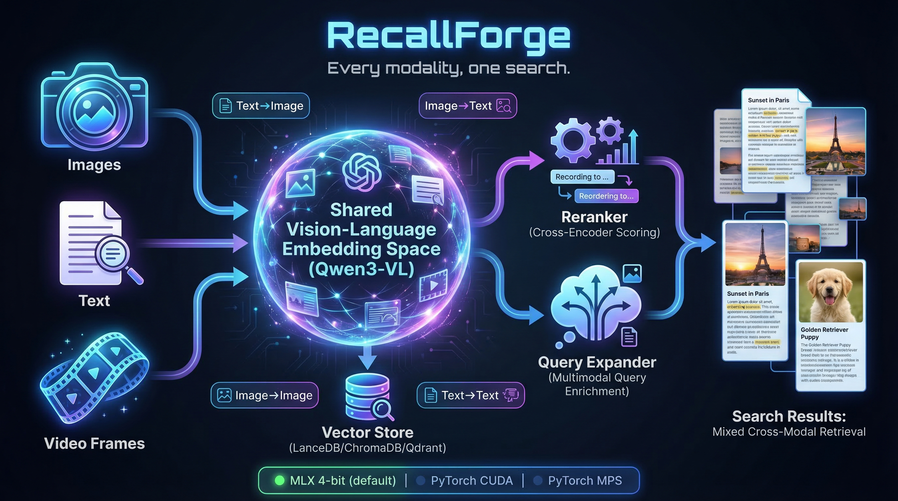

# RecallForge

**Every modality, one search. Local first.**

Images, text, and video frames live in the same semantic space. Search across all of them. Nothing leaves your machine.



Type a text query, find the relevant photo. Submit an image, find related documents. Search image-to-image for visual similarity. RecallForge puts every modality into a shared Qwen3-VL embedding space so cross-modal retrieval just works.

```bash
pip install recallforge            # auto-detects: MLX on Apple Silicon, PyTorch elsewhere
pip install recallforge[mlx]       # force MLX backend (Apple Silicon)
pip install recallforge[cuda]      # force CUDA backend (NVIDIA GPU)
```

```bash
recallforge index ./photos ./docs  # index images and text together
recallforge search "whiteboard diagram from last meeting"
recallforge search --image photo.jpg  # find docs related to this image
```

## What makes RecallForge different

- **Cross-modal search in all four directions:** Text→Text, Text→Image, Image→Text, Image→Image
- **Shared vision-language embedding space:** Qwen3-VL encodes images and text into the same 2048-dim vectors
- **3-stage retrieval pipeline:** embedding → reranking → query expansion (all multimodal)
- **Runs on anything:** MLX 4-bit on Apple Silicon (~2GB), PyTorch fp16 on CUDA/MPS/CPU. Auto-detects the best backend.
- **Fast:** 161ms warm search (MLX), 414ms (PyTorch). Cold start 3.8s on MLX 4-bit.
- **Pick your tradeoff:** embed mode (1 model, ~2GB), hybrid (+ reranker, ~4GB), full (+ query expansion, ~8GB)
- **MCP server** for agent/tool integration
- **100% local:** All models run on-device. Your data never leaves your machine.
- **Swappable storage:** LanceDB default, ChromaDB and Qdrant coming

## Attribution

**RecallForge is inspired by [QMD](https://github.com/tobil/qmd) by [Tobi](https://github.com/tobil).**

QMD pioneered the multi-stage retrieval pipeline: embedding, reranking, and query expansion working together for high-quality search. RecallForge takes that pattern into the vision-language domain with cross-modal retrieval, multi-backend support, and tiered resource modes. Huge thanks to Tobi for the original architecture that made this possible.

---

## Features

- **Cross-Modal Search**: Query text to find images, or images to find text
- **Hybrid Search**: Combines BM25 + vector search with RRF fusion
- **Query Expansion**: Generates lexical, vector, and HyDE variants
- **Cross-Encoder Reranking**: Refines results with joint query-document scoring
- **Multi-Backend**: PyTorch (CUDA/MPS/CPU) or MLX (Apple Silicon)
- **Tiered Modes**: Choose your memory/quality tradeoff
- **MCP Integration**: Use as a Model Context Protocol server

## Installation

```bash
pip install recallforge
```

RecallForge auto-detects the best backend for your hardware:
- **Apple Silicon** → MLX 4-bit (fastest, ~2GB memory)
- **NVIDIA GPU** → PyTorch/CUDA
- **Everything else** → PyTorch/CPU

To force a specific backend, install the extra:

```bash
pip install recallforge[mlx]       # force MLX (Apple Silicon only)
pip install recallforge[cuda]      # force CUDA (NVIDIA only)
```

### From Source

```bash
git clone https://github.com/brianmeyer/recallforge.git
cd recallforge
pip install -e ".[mlx]"   # or just: pip install -e .
```

## Quick Start

### CLI Usage

```bash
# Index files
recallforge index ~/Documents --collection docs

# Search
recallforge search "machine learning algorithms"

# Start MCP server
recallforge serve --mode full

# Check status
recallforge status
```

### Python API

```python
from recallforge import get_backend, get_storage
from recallforge.search import HybridSearcher

# Initialize
backend = get_backend()  # Auto-detect best backend
storage = get_storage()  # Default: ~/.recallforge

# Warm up models
backend.warm_up()

# Index documents
storage.index_document(
    path="notes.md",
    text="My important notes about AI and machine learning...",
    collection="my_docs",
    model="Qwen3-VL-Embedding-2B",
    embed_func=backend.embed_text,
)

# Search
searcher = HybridSearcher(backend=backend, storage=storage, limit=10)
results = searcher.search("artificial intelligence")

for r in results:
    print(f"[{r.score:.3f}] {r.title}")
```

### MCP Server

```bash
# Start the MCP server
recallforge serve

# Or with specific mode
recallforge serve --mode hybrid --backend torch
```

Configure in Claude Desktop:

```json
{
  "mcpServers": {
    "recallforge": {
      "command": "recallforge",
      "args": ["serve", "--mode", "full"]
    }
  }
}
```

## Tiered Search Modes

RecallForge supports three search modes with different memory/quality tradeoffs:

### `embed` Mode (~2GB MLX 4-bit / ~4GB PyTorch)

- **Models**: Embedder only
- **Search**: BM25 + Vector
- **Best for**: Memory-constrained environments, fast searches
- **Measured**: 161ms warm search, 3.7GB peak RSS (MLX 4-bit, 1000+ docs indexed)

```bash
recallforge serve --mode embed
```

```python
os.environ["RECALLFORGE_MODE"] = "embed"
```

### `hybrid` Mode (~4GB MLX 4-bit / ~8GB PyTorch)

- **Models**: Embedder + Reranker
- **Search**: BM25 + Vector + Reranking
- **Best for**: Balanced quality and memory usage

```bash
recallforge serve --mode hybrid
```

### `full` Mode (~8GB MLX / ~12GB PyTorch) [Default]

- **Models**: Embedder + Reranker + Query Expander
- **Search**: BM25 + Vector + Expansion + Reranking
- **Best for**: Maximum retrieval quality

```bash
recallforge serve --mode full
```

## Model Backends

RecallForge auto-detects the best backend (`RECALLFORGE_BACKEND=auto`):

| Hardware | Backend | Cold Start | Warm Search | Peak RSS (embed) |
|----------|---------|-----------|-------------|-----------------|
| Apple Silicon | MLX 4-bit | 3.8s | 161ms | ~2GB |
| Apple Silicon | MLX bf16 | 4.5s | 200ms | ~4GB |
| Apple Silicon | PyTorch/MPS | 8.4s | 412ms | ~4GB |
| NVIDIA GPU | PyTorch/CUDA | varies | varies | ~4GB |

### MLX Backend (Default on Apple Silicon)

Auto-selected on Apple Silicon. Uses 4-bit quantization by default for minimal memory.

```bash
export RECALLFORGE_BACKEND=mlx           # explicit
export RECALLFORGE_MLX_QUANTIZE=4bit     # default (or bf16 for higher precision)
```

**Model IDs (4-bit — fully native MLX):**
- Embedder: `arthurcollet/Qwen3-VL-Embedding-2B-mlx-4bit`
- Reranker: `arthurcollet/Qwen3-VL-Reranker-2B-mlx-4bit`
- Expander: `bmeyer2025/qmd-query-expansion-qwen3.5-2B-mlx-4bit`

**Model IDs (BF16):**
- Embedder: `arthurcollet/Qwen3-VL-Embedding-2B-mlx`
- Reranker: `arthurcollet/Qwen3-VL-Reranker-2B-mlx`
- Expander: `tobil/qmd-query-expansion-qwen3.5-2B` (PyTorch fallback)

### PyTorch Backend

Works on CUDA, MPS (Apple Silicon), and CPU. Auto-selected when MLX is unavailable.

```bash
export RECALLFORGE_BACKEND=torch
```

**Model IDs:**
- Embedder: `Qwen/Qwen3-VL-Embedding-2B`
- Reranker: `Qwen/Qwen3-VL-Reranker-2B`
- Expander: `tobil/qmd-query-expansion-qwen3.5-2B`

## Storage Backend

Currently supports **LanceDB** with vector search and Tantivy FTS:

```bash
export RECALLFORGE_STORAGE=lancedb  # Default
export RECALLFORGE_STORE_PATH=~/.recallforge  # Default
```

Future support planned for:
- ChromaDB
- Qdrant

### Namespace/Profile Filtering

RecallForge supports optional namespace fields for multi-tenant isolation:

- `user_id`: User namespace filter
- `session_id`: Session namespace filter
- `project_id`: Project namespace filter
- `profile`: Profile namespace filter

All memory tools (`memory_add`, `memory_update`, `memory_delete`, `index_folder`, `ingest`) accept these optional fields. Search tools (`search`, `search_fts`, `search_vec`) can filter by these fields.

```python
# Index with namespace
storage.upsert_memory(
    path="notes.md",
    text="My notes",
    collection="docs",
    embed_func=embed,
    model="Qwen3-VL-Embedding-2B",
    user_id="alice",
    project_id="proj123",
)

# Search with namespace filter
results = storage.search_fts(
    query="notes",
    user_id="alice",
    project_id="proj123",
)
```

This enables multi-user, multi-project, and multi-session isolation within a single RecallForge instance.

## MCP Tools

When running as an MCP server, use `ingest` as the **primary** tool for agents. It handles text, image, single-file, and folder ingestion in one call.

The lower-level tools (`index_document`, `index_image`, `memory_add`, `memory_update`, `memory_delete`, `index_folder`) remain available for advanced or explicit workflows.

### `ingest` (recommended)

Unified ingest entry point.

```json
{
  "text": "optional raw text content",
  "path": "optional/path/for/raw-text.md",
  "file_path": "/path/to/file-or-image",
  "folder_path": "/path/to/folder",
  "recursive": true,
  "collection": "default",
  "content_types": ["text", "image"],
  "include_globs": ["**/*"],
  "exclude_globs": ["**/.git/**"],
  "user_id": "optional user namespace",
  "session_id": "optional session namespace",
  "project_id": "optional project namespace",
  "profile": "optional profile namespace"
}
```

Returns a unified summary with:
- `indexed_text`
- `indexed_images`
- `skipped`
- `errors`
- `items[]` (`path`, `type`, `status`)

### `search`

Full hybrid search with all pipeline stages.

```json
{
  "query": "machine learning algorithms",
  "limit": 10,
  "collection": "docs",
  "content_type": "text",
  "user_id": "optional user namespace",
  "session_id": "optional session namespace",
  "project_id": "optional project namespace",
  "profile": "optional profile namespace"
}
```

### `search_fts`

BM25 full-text search only.

```json
{
  "query": "neural networks",
  "limit": 20,
  "user_id": "optional user namespace",
  "session_id": "optional session namespace",
  "project_id": "optional project namespace",
  "profile": "optional profile namespace"
}
```

### `search_vec`

Vector similarity search only.

```json
{
  "query": "document about AI",
  "limit": 20,
  "user_id": "optional user namespace",
  "session_id": "optional session namespace",
  "project_id": "optional project namespace",
  "profile": "optional profile namespace"
}
```

### `index_document`

Index a text document.

```json
{
  "path": "notes.md",
  "text": "Document content here...",
  "collection": "my_docs"
}
```

### `index_image`

Index an image for cross-modal search.

```json
{
  "path": "/path/to/image.png",
  "collection": "images"
}
```

### `memory_add`

Add (or replace) a text memory by path. Supports optional metadata for importance, TTL, and tags.

```json
{
  "path": "memory/projects/recallforge.md",
  "text": "Phase 1 MCP memory tools are implemented.",
  "collection": "default",
  "user_id": "optional user namespace",
  "session_id": "optional session namespace",
  "project_id": "optional project namespace",
  "profile": "optional profile namespace",
  "importance": 0.8,
  "ttl_seconds": 86400,
  "tags": ["project", "ai", "mcp"]
}
```

**Parameters:**
- `path` (required): Memory path key within collection
- `text` (required): Memory content
- `collection` (optional): Collection name, default "default"
- `user_id` (optional): Optional user namespace for multi-tenant isolation
- `session_id` (optional): Optional session namespace
- `project_id` (optional): Optional project namespace
- `profile` (optional): Optional profile namespace
- `importance` (optional): Importance score 0.0-1.0 for ranking/filtering
- `ttl_seconds` (optional): Time-to-live in seconds (0 or null = no expiration)
- `tags` (optional): Array of string tags for categorization

### `memory_update`

Update existing memory text by path without duplicating old vectors. Supports the same metadata as `memory_add`.

```json
{
  "path": "memory/projects/recallforge.md",
  "text": "Phase 1 complete. Added update/delete/index_folder tooling.",
  "collection": "default",
  "user_id": "optional user namespace",
  "session_id": "optional session namespace",
  "project_id": "optional project namespace",
  "profile": "optional profile namespace",
  "importance": 0.9,
  "ttl_seconds": 604800,
  "tags": ["project", "ai", "mcp", "completed"]
}
```

**Parameters:**
- `path` (required): Memory path key within collection
- `text` (required): Updated memory content
- `collection` (optional): Collection name, default "default"
- `user_id` (optional): Optional user namespace for multi-tenant isolation
- `session_id` (optional): Optional session namespace
- `project_id` (optional): Optional project namespace
- `profile` (optional): Optional profile namespace
- `importance` (optional): Importance score 0.0-1.0
- `ttl_seconds` (optional): Time-to-live in seconds
- `tags` (optional): Array of string tags

**TTL Behavior:**
- Memories with `ttl_seconds > 0` will automatically expire and be excluded from search results
- Expired entries are filtered out in both FTS and vector search
- Setting `ttl_seconds` to 0 or omitting it creates a permanent memory (no expiration)

### `memory_delete`

Deactivate a memory entry and remove associated embeddings.

```json
{
  "path": "memory/projects/recallforge.md",
  "collection": "default",
  "user_id": "optional user namespace",
  "session_id": "optional session namespace",
  "project_id": "optional project namespace",
  "profile": "optional profile namespace"
}
```

### `index_folder`

Index text files from a folder into memory entries.

```json
{
  "folder_path": "/Users/me/notes",
  "collection": "default",
  "recursive": true,
  "include_globs": ["**/*.md", "**/*.txt"],
  "exclude_globs": ["**/.git/**", "**/node_modules/**"],
  "user_id": "optional user namespace",
  "session_id": "optional session namespace",
  "project_id": "optional project namespace",
  "profile": "optional profile namespace"
}
```

### `status`

Get server status.

```json
{}
```

### `rebuild_fts`

Rebuild the full-text search index.

```json
{}
```

## Configuration

### Environment Variables

| Variable | Default | Description |
|----------|---------|-------------|
| `RECALLFORGE_BACKEND` | `auto` | Model backend: `auto`, `mlx`, `torch` |
| `RECALLFORGE_MODE` | `full` | Search mode: `embed`, `hybrid`, `full` |
| `RECALLFORGE_MLX_QUANTIZE` | `4bit` | MLX quantization: `4bit`, `bf16` |
| `RECALLFORGE_STORAGE` | `lancedb` | Storage backend |
| `RECALLFORGE_STORE_PATH` | `~/.recallforge` | Storage directory |

### CLI Options

```bash
recallforge serve \
  --mode full \
  --backend auto \
  --quantize bf16 \
  --store-path ~/.recallforge
```

## Architecture

```
RecallForge
├── recallforge/
│   ├── backends/          # Model backends
│   │   ├── base.py        # ModelBackend ABC
│   │   ├── torch_backend.py
│   │   └── mlx_backend.py
│   ├── storage/           # Storage backends
│   │   ├── base.py        # StorageBackend ABC
│   │   └── lancedb_backend.py
│   ├── search.py          # Hybrid search pipeline
│   ├── server.py          # MCP server
│   └── cli.py             # CLI interface
└── tests/
    ├── test_live.py       # Live tests with real models
    └── benchmark.py       # Benchmark suite
```

### Search Pipeline

1. **BM25 Probe**: Initial retrieval to detect strong signal
2. **Query Expansion** (full mode): Generate lex/vec/hyde variants
3. **Parallel Searches**: BM25 + Vector searches via ThreadPoolExecutor
4. **RRF Fusion**: Reciprocal Rank Fusion to combine result lists
5. **Reranking** (hybrid/full): Cross-encoder relevance scoring
6. **Score Blending**: Weighted combination of RRF and rerank scores

## Benchmarks

### Performance (Mac mini M4 16GB, MLX 4-bit, embed mode)

| Metric | Value |
|--------|-------|
| Cold start | 3.8s |
| Warm search p50 | 161ms |
| Warm search p95 | 200ms |
| Text indexing | 5 docs/sec |
| Peak RSS | 3.7 GB |
| FTS (1000 docs) | 473ms |
| Vector search (1000 docs) | 429ms |

### Cross-Modal Retrieval Accuracy

Run the benchmark:

```bash
python benchmarks/cross_modal_accuracy.py --backend auto --mode embed --dataset coco --limit 1000
```

Results are saved to `benchmarks/cross_modal_results.json` and `benchmarks/CROSS_MODAL.md`.

## Development

### Running Tests

```bash
# Unit tests (with mocks)
pytest tests/ -m "not live"

# Live tests (real models, slow)
pytest tests/ -m live -v

# All tests
pytest tests/ -v
```

### Code Style

```bash
# Format
black recallforge tests

# Lint
ruff check recallforge tests
```

## License

MIT License

## Acknowledgments

- **Tobi** for [QMD](https://github.com/tobil/qmd) - the original inspiration
- **Qwen Team** for Qwen3-VL-Embedding and Qwen3-VL-Reranker
- **LanceDB** for the excellent vector database